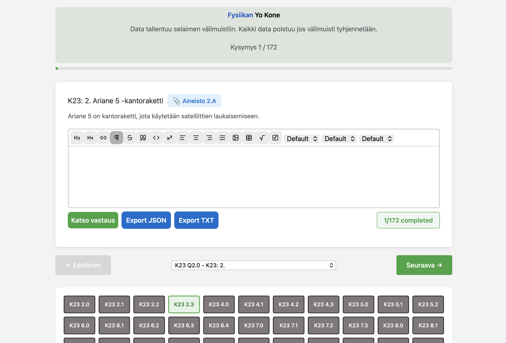

# Fysiikan Yo Kone

Website for finnish physics matriculation exam preparation.

## Features

- LaTeX support
- Custom headings and highlights
- LocalStorage saving
- Fast and private

## FAQ

#### Who is this for ?
The website is made for finnish general matriculation students preparing for their physics matriculation exams.

#### Does it need login ?

At the moment (1.12) no it runs local using localstorage on browser but login is in process.

## 🔗 Links

